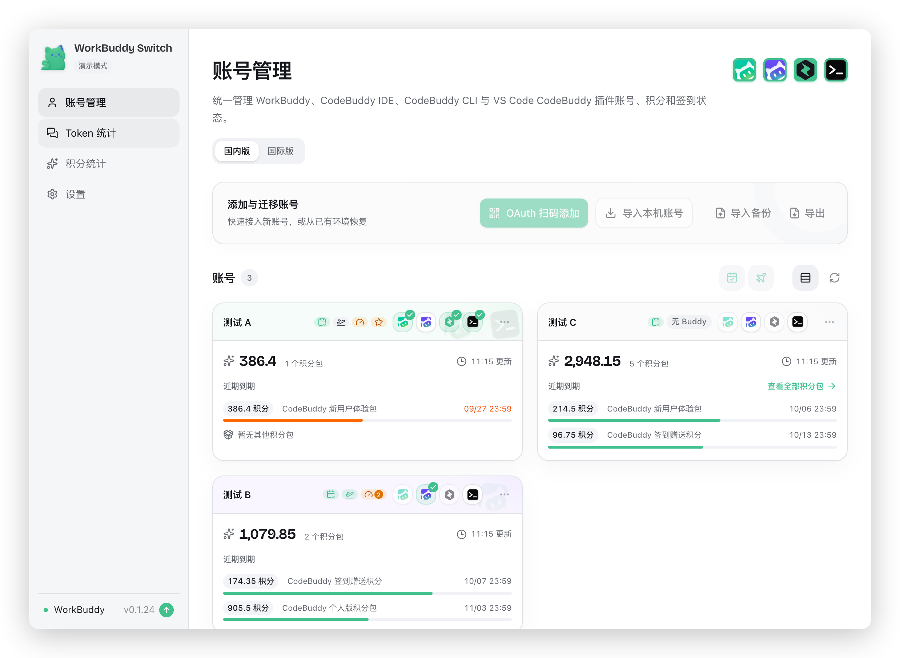
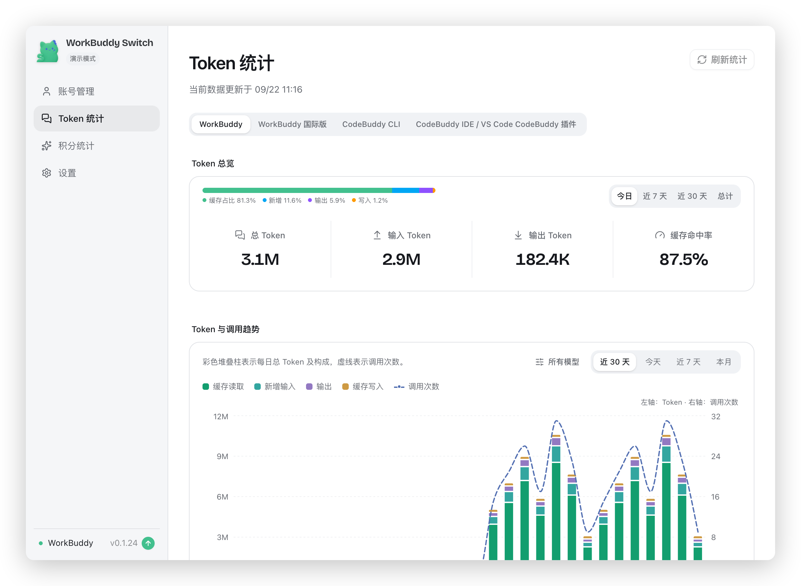

# workbuddy-switch

WorkBuddy、CodeBuddy IDE、CodeBuddy CLI 与 VS Code CodeBuddy 插件账号切换工具。以**官方插件**形态
接入 CodeBuddy / WorkBuddy（无需单独启动任何程序），四者均支持国内版 / 国际版，并提供积分到期与
Token 用量监控。

<p align="center">
  
</p>

多账号共享登录态，一键切换各客户端登录账号。**会话迁移**：把当前对话复制给另一个账号，源账号数据
不受影响，云端归属目标账号。

**在线演示**：[打开 GitHub Pages 演示](https://yushenghai1106.github.io/switch_plugin_wkbdy/)（只读演示；账号、积分与请求记录均为虚构数据，所有业务操作均已禁用）

> **形态说明**：本项目已从「独立桌面 App」转为「CodeBuddy / WorkBuddy 插件」。插件通过 MCP 工具
> 提供全部能力，并自动拉起后台任务（签到 / 自动轮换 / 派猫猫旅行 / 限额监听）。
> 桌面安装包不再发布；原先内置的会话悬浮栏请改用独立的 [Agent Companion](https://github.com/changexbc/agent-companion)。

## 快速开始

在 CodeBuddy 或 WorkBuddy 里执行（三步）：

```
/plugin marketplace add yushenghai1106/switch_plugin_wkbdy
/plugin install workbuddy-switch@wb-switch-market
/reload-plugins
```

然后**完全重启客户端**（hook 与 MCP 配置在启动时读取）。重启后即可用自然语言或斜杠命令使用：

```
/wb-switch:status              查看当前账号
/wb-switch:switch-account      切换账号
/wb-switch:export-conversation 把当前对话导给另一个账号
```

插件首次运行会自动下载内核二进制到 `~/.wb-switch/bin/`（从 npm 平台包，支持镜像与离线覆盖，
见 [`plugin/README.md`](./plugin/README.md)）。

**需要图形界面时**：让 AI 调用 `wb_open_webui`，或直接运行下面的 npm 版本，会打开与插件同源的完整
Web 界面（账号管理、积分与 Token 统计图表）。

<details>
<summary>npm / webui 版本（内核的另一种宿主形态）</summary>

```bash
npm i -g @yushenghai/workbuddy-switch
workbuddy-switch              # 启动本地服务 + 自动打开浏览器
workbuddy-switch status       # 终端查看当前账号
workbuddy-switch daemon       # 只跑后台任务（前台查看输出）
workbuddy-switch daemon --stop  # 结束后台任务
```

界面与插件能力同源，覆盖下方全部模块；macOS 权限由启动服务的终端进程决定
（若终端已授权完全磁盘访问则无需额外操作）。
</details>

## 功能

| 模块 | 说明 |
| --- | --- |
| 账号管理 | OAuth 扫码登录、导入本机账号、导入 / 导出备份、删除账号 |
| 账号切换 | 一键切换各客户端登录账号；切换过程与结果如实回报（哪些端受影响、是否需要重开） |
| 导出当前对话 | 把**当前对话**复制给另一个账号（源账号不变、副本取新 id）；支持 WorkBuddy 与 VS Code CodeBuddy 插件两个来源 |
| 会话复制 | 按 id 把指定会话复制给目标账号，源账号数据不受影响 |
| 积分到期查询 | 自动查询每个账号的积分剩余量与到期时间；7 天内到期高亮，并按紧迫程度排序、标注「建议优先使用」 |
| 积分统计 | 汇总官方请求用量：总览、近 30 天趋势、模型分类、账号消耗与请求明细 |
| Token 统计 | 按来源查看 Token 总览与趋势，含构成占比、活跃热力图、项目/模型 Top 10 与会话排行 |
| CodeBuddy CLI | 与 WorkBuddy 复用同一账号库，默认账号独立；切换后立即生效，无需重启 CLI |
| CodeBuddy IDE | 支持切换 CodeBuddy IDE 桌面客户端账号，并可一并复制会话，与 CodeBuddy CLI 相互独立 |
| VS Code CodeBuddy 插件 | 支持切换 VS Code 内的 CodeBuddy 插件账号；VS Code 运行时可自动关闭并在写入后重开 |
| JetBrains IDE 插件 | 支持切换 IntelliJ IDEA / PyCharm 内的 CodeBuddy 插件账号，一次切换写入所有装了插件的 IDE |
| 后台任务 | 守护进程执行签到、自动轮换、派猫猫旅行、保活与限额监听；同一时刻只有一个执行者，可随时查询 / 停止 |
| 模型限额台账 | 汇总各账号当前受限的模型与官方恢复时刻 |
| 完整界面 | 需要图表时按需拉起本地 Web 界面并打开浏览器 |
| 权限检测 | macOS 授权引导（App 管理 / 完全磁盘访问拖拽授权 + 自动检测） |

> 原先内置的**会话悬浮栏（Agent Companion）**只随桌面版发布。本项目不再发布桌面安装包后，
> 请改用独立的 [Agent Companion](https://github.com/changexbc/agent-companion)（能力相同）。

## 支持的工具

| 工具 | 账号切换 | 会话复制 | 自动关闭重开 | 自动轮换 | 悬浮窗监听 |
| --- | :---: | :---: | :---: | :---: | :---: |
| WorkBuddy | ✅ | ✅ | ✅ | — | ✅ |
| CodeBuddy IDE | ✅ | ✅ | ✅ | — | ✅ |
| CodeBuddy CLI | ✅ | — | — | ✅ | — |
| VS Code CodeBuddy 插件 | ✅ | ✅ | ✅ | — | ✅ |
| JetBrains IDE 插件（IDEA / PyCharm） | ✅ | — | ✅ | — | — |

✅ 表示支持，— 表示不支持。设置 →「支持工具」可按客户端逐个开启 / 关闭入口；关闭后该端入口与状态轮询一并隐藏，不影响账号库与其它端；JetBrains 端默认关闭，可在设置中随时打开。

CodeBuddy CLI 切换时会先关闭正在运行的 CLI，当前会话会中断且不会自动重开；其余各端可在客户端运行时自动完成切换。

### 会话悬浮栏（Agent Companion）

原先由桌面版内置。本项目不再发布桌面安装包后，请改用独立的
[Agent Companion](https://github.com/changexbc/agent-companion)：把各 AI Agent 的任务状态集中到桌面，
一眼看出谁还在运行、谁需要你确认，点击可回到原会话。监听来源、跳转行为与外观设置见该仓库。

## 使用

插件装上后，直接对 AI 说需求，或用斜杠命令：

1. **添加账号**：`OAuth 扫码登录` / `导入本机账号` / `导入备份`（可让 AI 调 `wb_list_accounts` 查看账号库）
2. **切换账号**：`/wb-switch:switch-account` —— 说明切哪个客户端、切到哪个号
3. **导出当前对话**：`/wb-switch:export-conversation` —— 把当前对话复制给另一个账号
4. **查看积分与用量**：直接问「查一下积分」「这个月 Token 用量」，AI 会以表格汇报；
   需要图表时用 `wb_open_webui`（或 `workbuddy-switch` 命令）打开完整界面
5. **后台任务**：守护进程自动跑签到 / 自动轮换 / 派猫猫旅行 / 限额监听；
   问 AI「后台任务在跑吗」可查看状态，需要停下时让它调 `wb_daemon`（`action=stop`）
6. **更新**：`/plugin update workbuddy-switch`（客户端内）；内核版本随插件版本走，会自动重新下载

> 各客户端首次使用前可能需先手动打开并登录一次（例如 CodeBuddy IDE）。

## 界面预览

以下界面在需要时由 `wb_open_webui` 打开。

### 管理 WorkBuddy 与 CodeBuddy 账号

账号卡片集中展示登录状态、积分余额和到期资源，临期积分直接标注在对应卡片内，并按紧迫程度优先排列。



### 积分统计

积分统计页展示官方请求用量、每日趋势、模型分布、账号消耗和请求明细，数据来源与更新时间会明确显示。


### Token 统计

Token 统计页按来源展示 Token 总览与趋势、构成占比、活跃热力图、项目/模型 Top 10 与会话排行。



## macOS 权限说明

切换账号需要写入 WorkBuddy 认证文件，macOS 要求授权「App 管理」（或「完全磁盘访问」）。

插件形态下真正执行写入的是内核二进制 `~/.wb-switch/bin/wb-switch`（由客户端拉起）：

1. 首次切换报「无权限」时，打开「系统设置 → 隐私与安全性」
2. 在 **App 管理** 里打开对应条目；若列表里没有它，去 **完全磁盘访问** 手动添加
   `~/.wb-switch/bin/wb-switch`
3. 授权后重启客户端生效

> 归属到哪个条目取决于 macOS 的判定（内核二进制 / 拉起它的客户端），**建议两处都加上**。
> npm / webui 形态下由启动服务的终端进程决定（终端已授权则无需额外操作）。

## 致谢

感谢 [Linux.do](https://linux.do) 社区。

## 许可

[MIT](./LICENSE)
